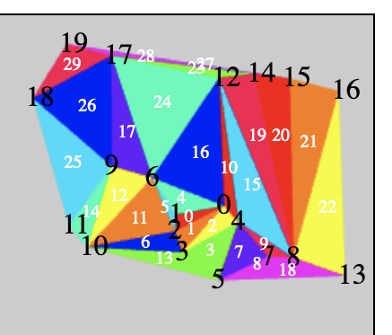

# delaunay-voronoi

Implementation of delaunay triangulation and voronoi diagrams. Can create a delaunay triangulation of random points using the sweep-hull algorithm. This can then be used to generate a voronoi diagram, the dual of a delaunay triangulation. Implemented in Godot using GDScript.

The numbers in black are labelling each point in the delaunay triangulation, randomly generated. The numbers in white are labelling the centroids of each triangle. Connecting adjacent centroids together with edges results in a voronoi diagram.

Build
===
The delaunay triangulation and voronoi diagram are printed as JSON to the console when the scene is played in the Godot editor.
